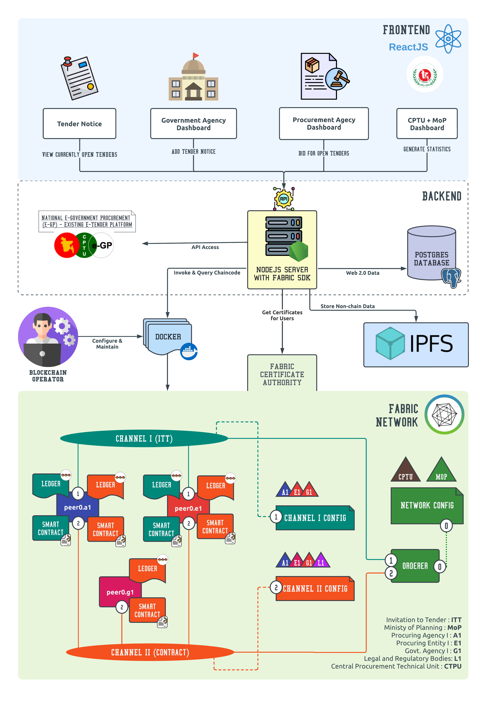
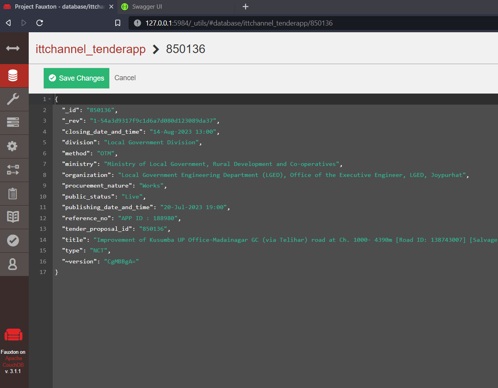
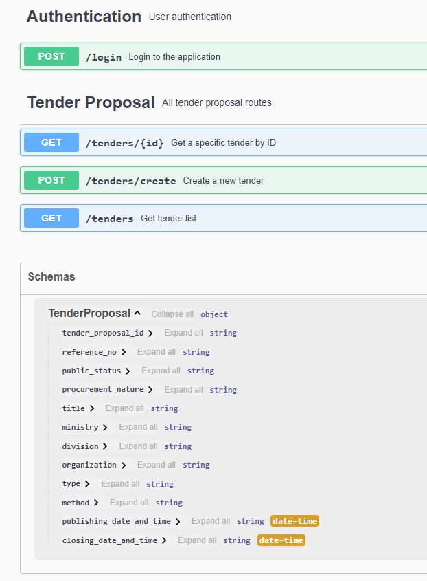

# A Blockchain Based Approach to Digitalize Public Procurement for Better Transparency, Privacy and Security

Public procurement refers to the process by which public authorities, such as government departments or local authorities, purchase work, goods or services from companies. However the process is still done manually and is prone to different kinds of tempering and frauds. This causes projects to be done with low quality and high costs. The chance of transparency is very low here too! The system is not self-sufficient and relies on external entities for different verification purposes. Each step increases the cost of the system. Blockchain is an emerging and disruptive decentralized technology that has the potential to significantly revolutionize, reshape, and transform the way data is being handled in public procurement. We have proposed a solution to control these problems using Hyperledger Fabric blockchain that creates a way for digitization of on-boarding of agencies such as local licensing authority of the government, procurement agencies  and provides a transparent system to conduct the whole public procurement process from start to finish . This unique approach can make the industry’s shift to electronic records faster and easier, preventing mismatches in data and decreasing the amount of frauds that occur in public procurement.


## Architecture


The figure shows a high-level overview of the architecture of our system. The blockchain admin configures the initial network configurations of our Hyperledger fabric network and gives credentials and necessary access to the Central Procurement Technical Unit (CPTU), IME Division of Ministry of Planning (MOP) who govern the system. All procuring agencies (PAs) and procuring entities (PEs) along with Government Agencies (GAs) are connected with each other in “Channel I”. All PAs, PEs, GAs, Legal Entities (LEs), auditors are connected with each other via “Channel II” for the contract and agreement reached by the agencies. The peers from each procuring entity are docker containers of the images of fabric-peer, orderer, and CA and each peer has a copy of the ledger and smart contracts deployed in them. CouchDB is used to store tender records data, contacts, agreements and other assets. A webserver is written in Nodejs with express js used to invoke and query the smart contracts and to provide the necessary APIs to communicate with the web client. Web clients are the tender notice, government agency dashboard, procuring agency dashboard and Central Procurement Technical Unit dashboard which use the REST APIs.

## Tech & Tools


## Development Evnironment
- Hyperledger Fabric - `v2.5`
- WSL2 - `ubuntu 22.04 LTS`
- Docker - `v24.0.`
- Docker Compose - `v2.19.1`
- Node - `v14.13.1`


## Installation

Installation and running of this project to the local machine may vary the dependencies. You may follow the Installation process:  


> Clone the repository to your local machine using the following command:

```bash
  git clone git@github.com:hmasum52/BCO23.git
```

> Running the fabric network
```
cd fabric/tenderapp
./startFabric.sh
```
> Running the backend
```
cd backend
npm start
```

## Demo Senerio
- `admin` is the `Central Procurement Technical Unit(CPTU)`
- `Orderer` is the `Ministry of Planning(MoP)`
- `Org1` is a `Procuring Agency i.e. Service Providers who bid against procurements`
- `Org2` is a `Goverment agency who creates procurements`

## Chaincode
> [primary-contract.js](/fabric/chaincode/tenderapp/javascript/lib/primary-contract.js)
```
class PrimaryContract extends Contract {

    // init the ledger with initial tender data
    async initLedger(ctx) {
        ...
    }

    //Read tender proposal details based on proposalId
    async readTenderProposal(ctx, tenderProposalId) {
        ...
    }

    // check if the TenderProposal exists in the ledger
    async tenderProposalExists(ctx, proposalId) {
        ...
    }

    // get assets from the ledger by query
    async getQueryResultForQueryString(ctx, queryString) {
        ...
    }

    async getAllTenderProposals(iterator,isHistory) {
       ...
    }
}
```
> [admin-contract.js](/fabric/chaincode/tenderapp/javascript/lib/admin-contract.js)
```

class AdminContract extends PrimaryContract {

    //Returns the last TenderProposal in the set
    async getLatestTenderProposalId(ctx) {
        ...
    }


    //Create TenderProposal in the ledger
    async createTenderProposal(ctx, args) {
        ...
    }


    //Read tenderProposal details based on tenderProposalId
    async readTenderProposal(ctx, tenderProposalId) {
        ...
    }


    //Delete tenderProposal from the ledger based on tenderProposalId
    async deleteTenderProposal(ctx, tenderProposalId) {
        ...
    }


    // Read the TenderProposal details based on the Organization Name
    async queryTenderProposalByOrganizationName(ctx, orgName) {
        ...
    }

    //Retrieves all TenderProposal details
    async queryAllTenderProposals(ctx) {
        ...
    }
}
```

## Initail tender data on Couchdb


## Api docs


## Frontend
[https://beecrypt.netlify.app/](https://beecrypt.netlify.app/)
> Demo

